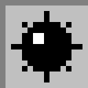

## Hi all!

I'm Evaristo and I'm Senior Software Developer at Schneider Electric. 

I am lucky that one of my hobbies has become my profession. But not only the software development is my hobby. I'm passionate about music and photography too.

[https://www.evaristocuesta.es](https://www.evaristocuesta.es "Evaristo Cuesta Fotografía Sevilla") Personal Photography Website

[https://www.evaristocuesta.com](https://www.evaristocuesta.com "Evaristo Cuesta .NET developer") Professional Software Developer Website

We can get in touch on [Twitter](https://www.linkedin.com/in/evaristocuesta/) or [Linkedin](https://twitter.com/evaristocuesta)

## Do you want to play Minesweeper?

Everyone is welcome to play Minesweeper. How do I play?
When you click a link (cell), it opens a Github Issue with the command and cell position in the title. Just push 'Submit new issue' without editing the title if you want to reveal the cell. If you want to flag the cell, replace 'revealcell' by 'flagcell' in the title. This issue will trigger a Git Actions workflow wich will execute a .NET 5 Console App. The README.md will be updated after some minutes.

Examples:
  - revealcell|3|4
  - flagcell|2|7
  
Watch this repository if you want to know when someone has played

Star this repository if you like it. 

## YOU HAVE WON - [NEW GAME](https://github.com/evaristocuesta/evaristocuesta/issues/new?title=newgame&body=Just+push+%27Submit+new+issue%27+without+editing+the+title+if+you+want+to+play+a+new+game.The+README.md+will+be+updated+after+some+minutes.)
|   |   |   |   |   |   |   |   |   |   |
| - | - | - | - | - | - | - | - | - | - |
|||||||||||
|||||||||||
|||||||||||
|||||||||||
|||||||||||
|||||||||||
|||||||||||
|||||||||||
|||||||||||
|||||||||||

### Last Moves
| User | Move |
| - | - |
|[@npanuhin](https://github.com/npanuhin)|revealcell(8, 5)|
|[@npanuhin](https://github.com/npanuhin)|revealcell(9, 4)|
|[@npanuhin](https://github.com/npanuhin)|revealcell(9, 3)|
|[@npanuhin](https://github.com/npanuhin)|revealcell(8, 4)|
|[@npanuhin](https://github.com/npanuhin)|revealcell(9, 5)|
|[@npanuhin](https://github.com/npanuhin)|revealcell(9, 6)|
|[@npanuhin](https://github.com/npanuhin)|flagcell(8, 6)|
|[@npanuhin](https://github.com/npanuhin)|revealcell(8, 0)|
|[@npanuhin](https://github.com/npanuhin)|flagcell(6, 0)|
|[@npanuhin](https://github.com/npanuhin)|revealcell(7, 0)|

### Top Moves
| User | Moves |
| - | - |
|[@antjacquemin](https://github.com/antjacquemin)|152|
|[@FatihKuyucak](https://github.com/FatihKuyucak)|75|
|[@shpatrickguo](https://github.com/shpatrickguo)|57|
|[@evaristocuesta](https://github.com/evaristocuesta)|57|
|[@alrifay](https://github.com/alrifay)|15|
|[@npanuhin](https://github.com/npanuhin)|12|
|[@pavleen14](https://github.com/pavleen14)|8|
|[@SoupSurvival](https://github.com/SoupSurvival)|7|
|[@Luciogc](https://github.com/Luciogc)|4|
|[@lemonnuggets](https://github.com/lemonnuggets)|4|

